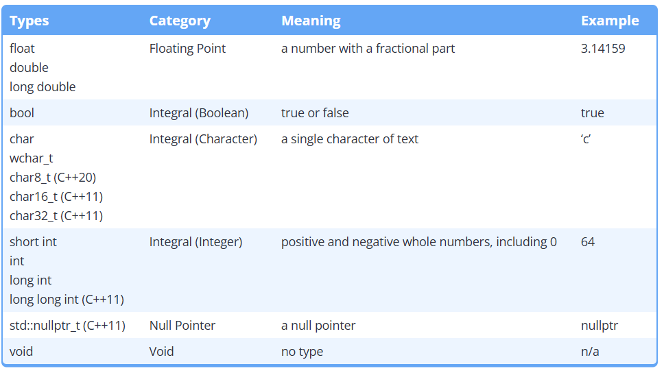
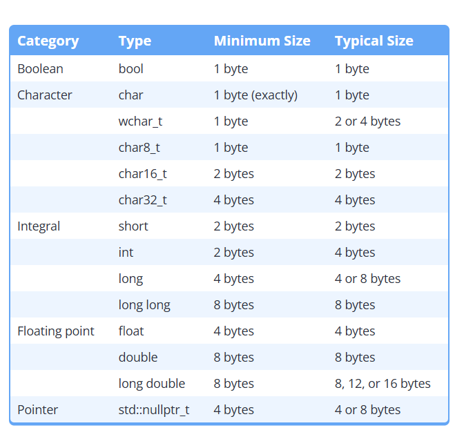
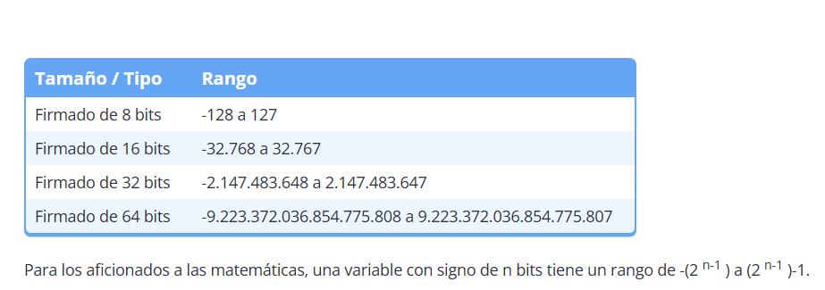
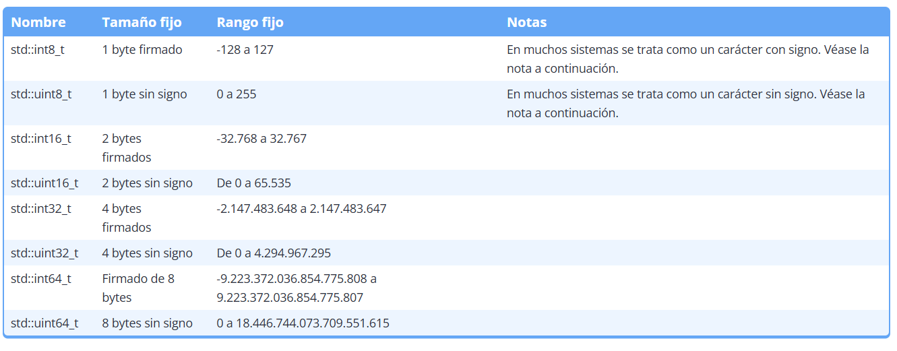

Tipos de datos -> presionar ctrl + shift + v para ver

Tamano en bits-> 

Enteros y el limite que puede almacenar cada tipo, segun el nro de bits que alojan en memoria -> 

Existen dos tipos de numeros integer, unsigned (sin signo), signed (con signo)
Estos son ejemplos de definicion de tipos :
#    unsigned short us; -> 10
#    unsigned int ui; -> 100 
#    unsigned long ul; -> 1000
#    unsigned long long ull

#   signed short us; -> +10 o -10...
....
#   signed long ul; -> +1000 o -1000

Distintas arquitecturas de computadora pueden manejar un tipo entero de dato distinto, por lo cual C++ establece un tipo de dato int, que es ocmpatible cualquiera sea la arquitectura del computador con la libreria estandar <cstdint>

Números enteros de ancho fijo
Para solucionar los problemas mencionados, C++11 proporciona un conjunto alternativo de tipos enteros que garantizan el mismo tamaño en cualquier arquitectura. Debido a que el tamaño de estos enteros es fijo, se les denomina enteros de ancho fijo .

Los enteros de ancho fijo se definen (en el encabezado <cstdint>) de la siguiente manera:

--------------
#include <cstdint> // for fixed-width integers
#include <iostream>

int main()
{
    std::int32_t x { 32767 }; // x is always a 32-bit integer
    x = x + 1;                // so 32768 will always fit
    std::cout << x << '\n';
    return 0;
}
--------------